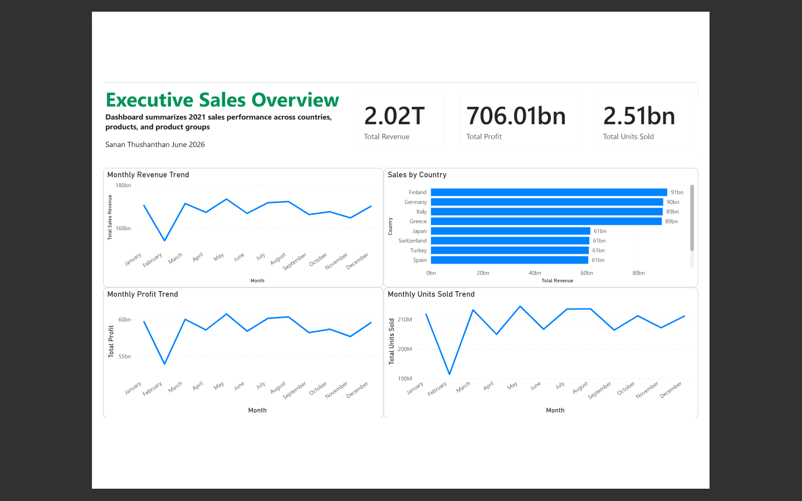
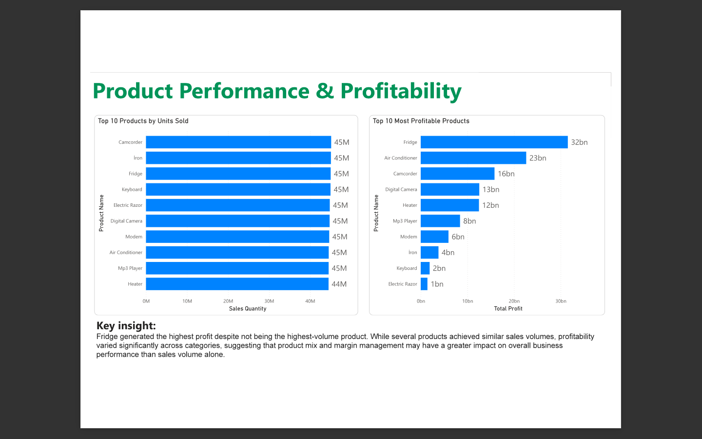
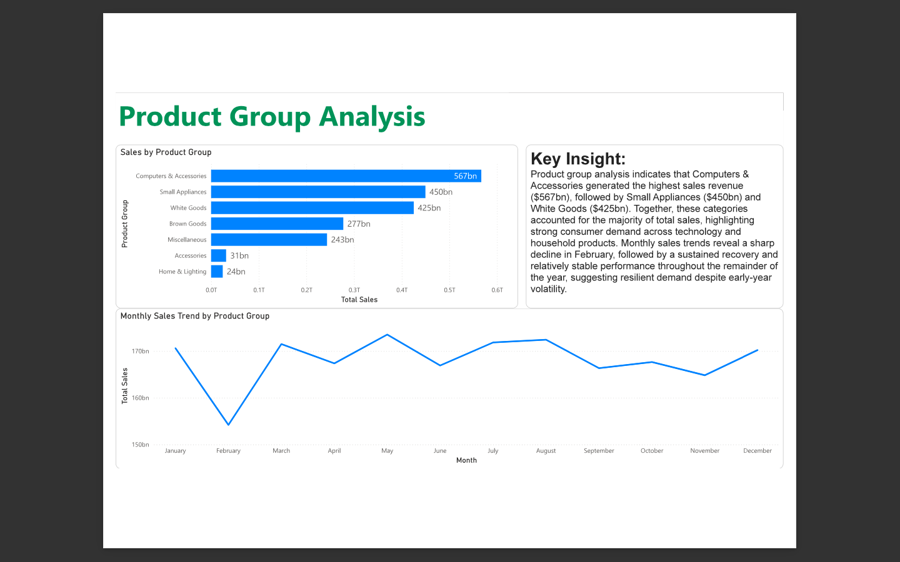

# Sales Performance Dashboard

## Overview
Developed an interactive Power BI dashboard analyzing revenue, profit, and sales performance across products, countries, and product groups.

## Tools
- Power BI
- DAX
- Power Query

## Key Features
- Executive KPI Dashboard
- Product Performance Analysis
- Profitability Analysis
- Sales Trend Analysis
- Country-Level Reporting

## Skills Demonstrated
- Dashboard Development
- KPI Reporting
- Data Visualization
- Business Analysis
- Data Storytelling

## Files
- Sales Dashboard.pbix
- Sales Dashboard.pdf

## Dashboard Preview

### Executive Overview

### Product Performance

### Product Group Analysis

